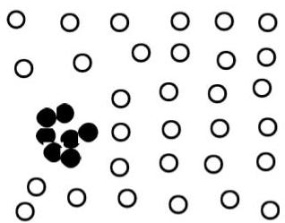

# Types of outliers (2/2)

## Collective Outliers

- a subset of observations that collectively significantly deviate from the whole data (even when each observation is not outlier)
- e.g. risk groups with rare/infrequent genetic variants
- issues
- consider both individual and group behavior
- need suitable distances

## Final considerations

- a dataset may have multiple types of outlier
- one observation may belong to more than one type of outlier

TÉCNICO+
FORMAÇÃO AVANÇADA