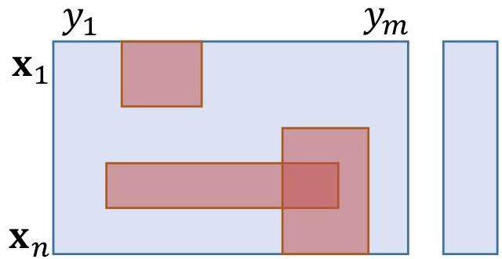

… extended to multivariate data

Patterns given by:

- value expectations on a subset of variables
- the pattern coverage is the set of observations satisfying those expectation
- the pattern defines a subspace
- association rules, i.e. values on some variables that discriminate the values on other variables
- supervised setting: input features in the antecedent and outcomes in the consequent
- unsupervised setting: free associations between input features

TÉCNICO+ FORMAÇÃO AVANÇADA