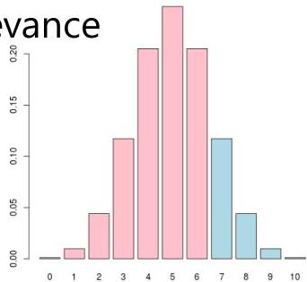

# Statistically significant patterns

- Given $N = 1000$, what is the probability of observing at least $n = 35$ users buying water and potatoes with $p = 0.03$?

- can be answered by computing the tail of a Binomial, i.e. $p(n &gt; 35 \mid n \sim \text{Binomial}(N, p))$
- $p(n \geq 35) = 0.15$, as 0.15 is above reference significance levels (0.05 or 0.01) for statistical tests, we can say that is not unexpectedly low and therefore not relevant
- if $n = 50$, then $p(n \geq 50) = 2.37E-4$, hence {water, potatoes} is relevant in such dataset

- Summary: joint probability and binomial testing to assess relevance

- How? scipy in python, excel...
- 1 – cumulative Binomial with $n$, $N$ and $p$ parameters (also known as survival function)

TÉCNICO+
FORMAÇÃO AVANÇADA