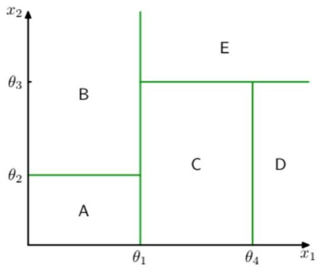
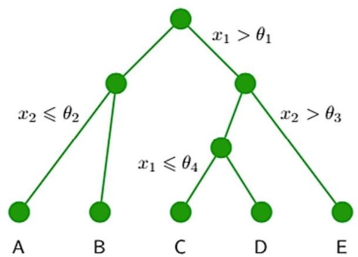

# Association rules are already familiar…

- Recall: **decision trees** for prediction
- each path from root to leaf is an association rule
- **classification** (classes on leaves) and **regression** (quantities on leaves)

TÉCNICO+
FORMAÇÃO AVANÇADA