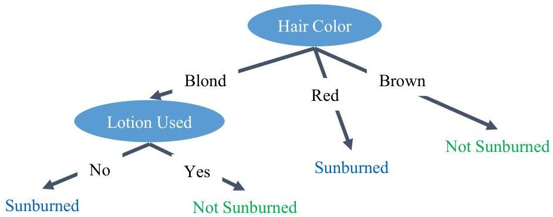

# Association rules are already familiar…

|  Name | Hair | Height | Weight | Lotion | Result  |
| --- | --- | --- | --- | --- | --- |
|  Sarah | blonde | average | light | no | sunburned (positive)  |
|  Dana | blonde | tall | average | yes | none (negative)  |
|  Alex | brown | short | average | yes | none  |
|  Annie | blonde | short | average | no | sunburned  |
|  Emily | red | average | heavy | no | sunburned  |
|  Pete | brown | tall | heavy | no | none  |
|  John | brown | average | heavy | no | none  |
|  Katie | blonde | short | light | yes | none  |

If the person's hair is blonde and the person uses lotion then nothing happens

If a person's hair color is blonde and the person uses no lotion then the person turns red

If the person's hair color is red then the person turns red

If the person's hair color is brown then nothing happens

24

TÉCNICO+

FORMAÇÃO AVANÇADA