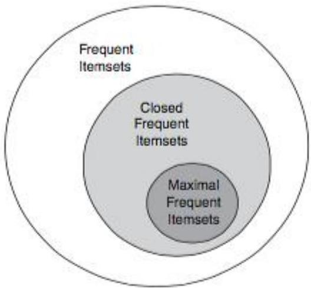

# Condensed patterns

- A long pattern contains a combinatorial high number of subpatterns
- Example: $\varphi = \{yi_{1,\dots}, yi_{100}\}$ contains $\binom{100}{2} + \binom{100}{3} + \cdots + \binom{100}{99} = 1.27 \times 10^{30}$ sub-patterns!

- Solution:
- Mine closed patterns or maximal patterns only
- A pattern $P1$ is **maximal** if $P1$ is frequent and there exists no frequent super-pattern $P2 \supset P1$
- A pattern $P1$ is **closed** if $P1$ is frequent and there exists no super-pattern $P2 \supset P1$, with the same support as $P1$

TÉCNICO+
FORMAÇÃO AVANÇADA