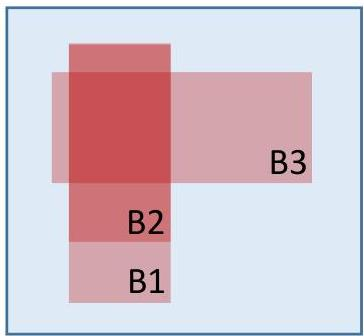

# Condensed patterns: maximal and closed

- Given a pattern $\varphi$
- a subspace with a smaller pattern, $|\varphi(B1)| &lt; |\varphi(B3)|$, generally has more supporting observations (vertical shape)
- a subspace with a larger pattern, $|\varphi(B3)| &gt; |\varphi(B2)|$, generally has lower coverage (horizontal shape)

- In the right example:
- Closed patterns? B1 and B3
- Maximal patterns? B3

- Closed representations is a lossless compression of patterns
- default representation when pattern mining

- Maximal pattern representations can cause the loss of relevant patterns
- vertical shaped patterns are generally neglected in preference towards horizontal ones

TÉCNICO+
FORMAÇÃO AVANÇADA