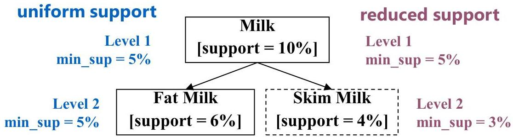

# Multi-level associations

- Items in transactional databases or categories in multivariate data often form hierarchies
- Flexible support settings: items at the lower level are expected to have lower support

- some rules may be redundant due to "ancestor" relationships between items. Example
- milk ⇒ wheat bread [support = 8%, confidence = 70%]
- fat milk ⇒ wheat bread [support = 2%, confidence = 72%]

- we say the first rule is an ancestor of the second rule
- a rule is redundant if its support is close to the "expected" value based on rule's ancestor

43