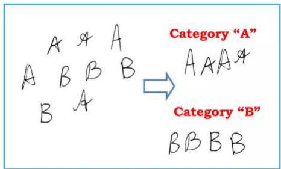
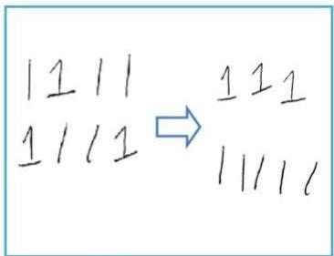

# Pattern Recognition

- Why patterns matter:
- artificial agents do not understand meaning directly
- patterns offer a way to minimize (descriptive or predictive) error on observed data
- good generalization capacity if those patterns also hold in unseen data
- useful patterns (signals) → generalize
- spurious patterns (noise) → overfitting

- Patterns seem to be everything and nothing!
- indeed pattern recognition became a proxy name to machine learning

Classification

Clustering

TÉCNICO+
FORMAÇÃO AVANÇADA