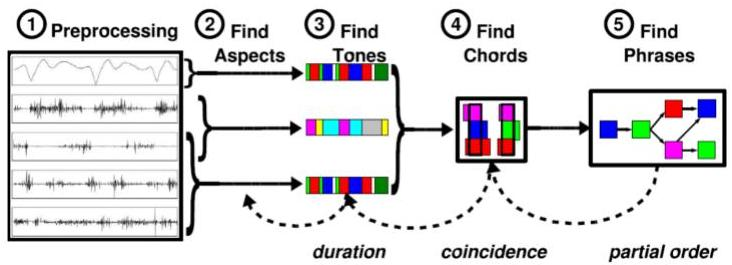
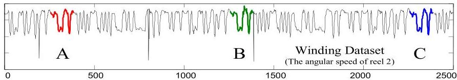

Details in our next class!

# Complex data: a snippet

A snippet view on patterns in temporal data structures where **frequency** can be considered...

- **across** time series observations
- sequential pattern mining (frequent orders)
- biclustering (univariate time series data)
- triclustering (multivariate time series data)
- temporal association rules

- **within** a single time series
- motif discovery
- predictive rule mining A ⇒ Δt B

once antecedent is observed, consequent expected within interval Δt

TÉCNICO+

FORMAÇÃO AVANÇADA