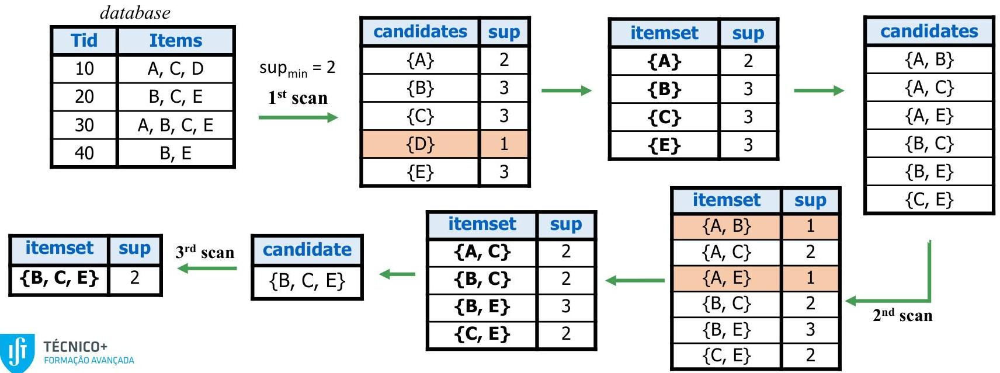

# Apriori

- Principle: if a pattern is infrequent, its superset is infrequent (should not be generated)
- Method: iteratively increase (k+1)-length candidate patterns from k-length frequent patterns

database

|  Tid | Items  |
| --- | --- |
|  10 | A, C, D  |
|  20 | B, C, E  |
|  30 | A, B, C, E  |
|  40 | B, E  |

TÉCNICO+

FORMAÇÃO AVANÇADA