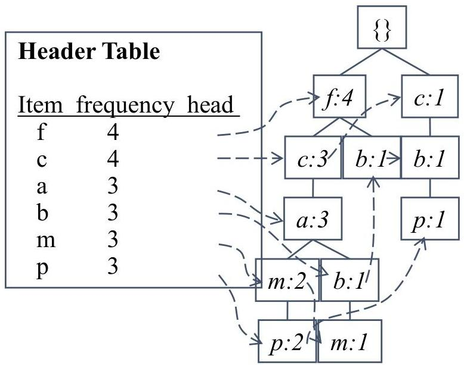

# FP-Growth

|  TID | Items bought | (ordered) frequent items  |
| --- | --- | --- |
|  100 | {f, a, c, d, g, i, m, p} | {f, c, a, m, p}  |
|  200 | {a, b, c, f, l, m, o} | {f, c, a, b, m}  |
|  300 | {b, f, h, j, o, w} | {f, b}  |
|  400 | {b, c, k, s, p} | {c, b, p}  |
|  500 | {a, f, c, e, l, p, m, n} | {f, c, a, m, p}  |

- divide-and-conquer
- decompose the mining task according to the frequent patterns obtained so far
- leads to focused search of smaller databases
- no candidate generation, no candidate test
- no repeated scans of entire database
- compressed database: FP-tree structure
- efficient counting operations on the FP-tree

TÉCNICO+
FORMAÇÃO AVANÇADA