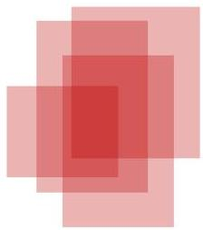

# Mining closed patterns (CLOSET)

- Recall: closed representations are lossless
- useful to remove subspaces contained in large ones
- relevant for large patterns and spaces with high homogeneity
- List of all frequent items in support ascending order, e.g. $d$-$a$-$f$-$e$-$c$
- Divide search space
- patterns having $d$
- patterns having $d$ but no $a$, etc.
- Find frequent closed pattern recursively
- every transaction having $d$ has $cfa$, hence $cfad$ is a closed pattern

min support =2

|  ID | items  |
| --- | --- |
|  10 | a, c, d, e, f  |
|  20 | a, b, e  |
|  30 | c, e, f  |
|  40 | a, c, d, f  |
|  50 | c, e, f  |

TÉCNICO+
FORMAÇÃO AVANÇADA