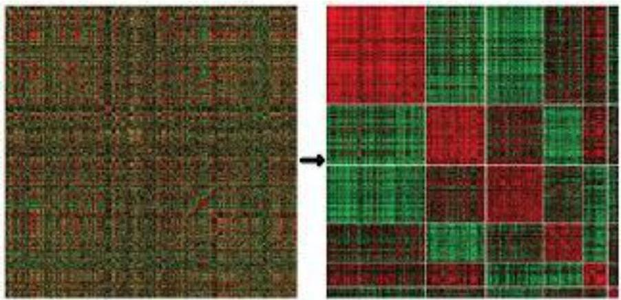

# Coherence

- Homogeneity commonly guaranteed through a merit function
- e.g. the variance of the values in a subspace

Low variance can be used to find biclusters with constant values

TÉCNICO+ FORMAÇÃO AVANÇADA