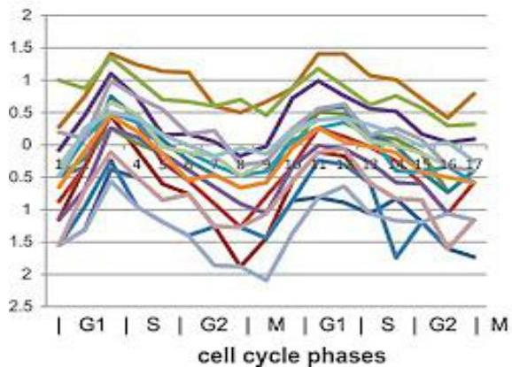

# Additive model

## Why?

- medical field: handle individual differences, different stages of disease progression
- biological field: responsiveness of genes, experimental differences
- social field: individual differences regarding activity

TÉCNICO+
FORMAÇÃO AVANÇADA