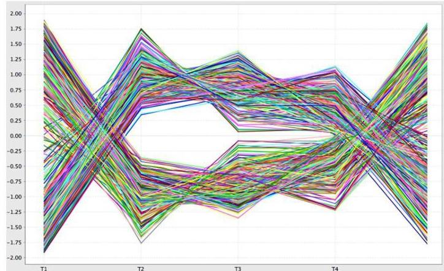
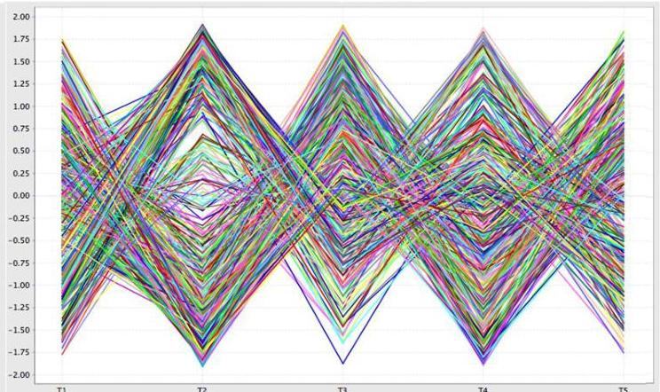

# Symmetries

- Symmetries can be accommodated on observations: $a_{ij} \times k_i$ where $k_i \in \{1, -1\}$
- e.g. activation and repression regulatory patterns

level of expression
a. Constant (with symmetries)
conditions

level of expression
b. Multiplicative (with symmetries)
conditions

TÉCNICO+

FORMAÇÃO AVANÇADA