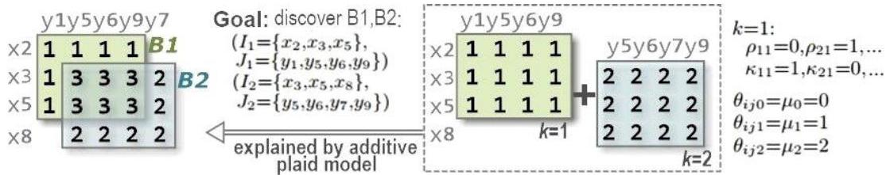
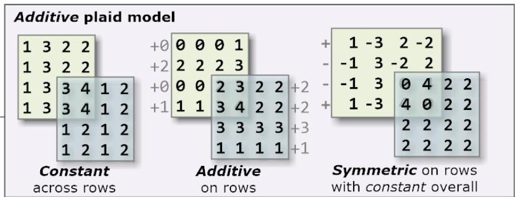

# Plaid model

The plaid assumption considers the cumulative effect of the contributions from multiple bicusters on areas where their observations and variables overlap

Why? Synergistic behaviors (e.g. social networking, comorbidity effects, multi-purpose genes)

TÉCNICO+
FORMAÇÃO AVANÇADA