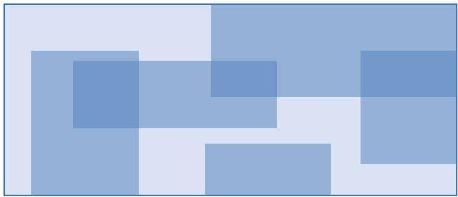

# Flexible structures

- Arbitrarily positioned (possibly overlapping) biclusters

- Biclustering solutions with flexible positioning can be associated with redundant patterns
- searches should further include dissimilarity criteria
(e.g. merging biclusters with high overlapping at mining or postprocessing time)

TÉCNICO+
FORMAÇÃO AVANÇADA
27