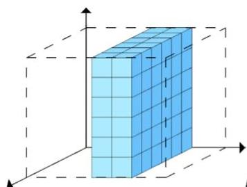
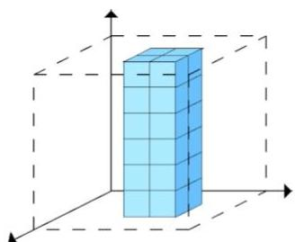
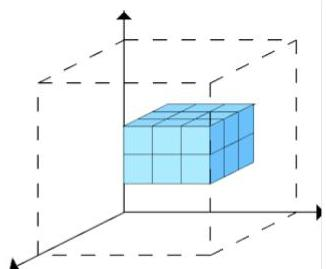

# Triclustering

- How to move from univariate to multivariate time series (MTS) data?
- multivariate data is defined by a set of observations, variables and time points

- Solution: triclustering
- a tricluster is a subset of observations, variables and time points with good:
- homogeneity, e.g. well established temporal pattern on a subset of variables
- statistical significance, e.g. unexpected high #observations supporting the pattern

Full-clustering on attributes

Full-clustering on observations

Partial-clustering (all attributes)

Partial-clustering (all observations)

Triclustering

TÉCNICO+
FORMAÇÃO AVANÇADA