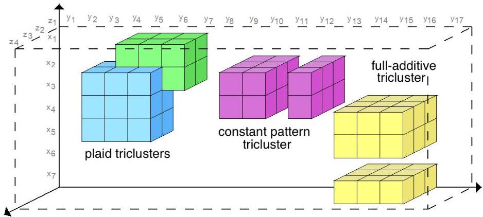
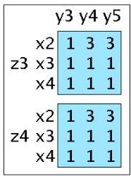
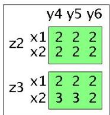
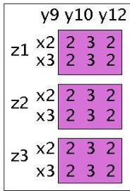
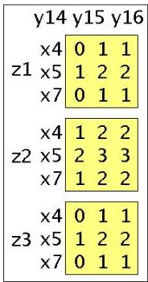
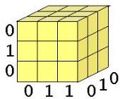

# Triclustering

Triclusters with low variance and cumulative effects on overlapping regions

Tricluster with constant pattern on observations and contexts

Tricluster with low mean square residue

TÉCNI
FORMAÇÃO AVANÇADA