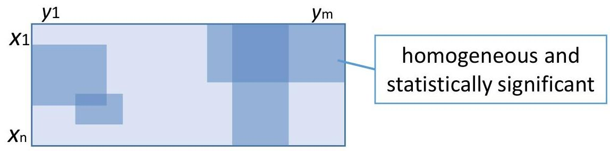

# Motivation

|  2 2 2
2 2 3
2 ? 2 | Constant overall with noise and missing  |
| --- | --- |
|  1 3 2
1 3 2
1 3 2 | Constant across rows  |
|  +0 +2 +1
1 3 2
4 6 5
3 4 4 | Additive on columns  |
|  2x
-1x
1x | 2 -6 4
-1 3 -2
1 -3 2  |
|  Multiplicative with symmetries on rows | Multiplicative with constant overall  |
|  1 1 3
1 3 2
1 2 2 | 2 3 1
1 3 0
3 4 2  |
|  Order preserving across rows  |   |

TÉCNICO+

FORMAÇÃO AVANÇADA