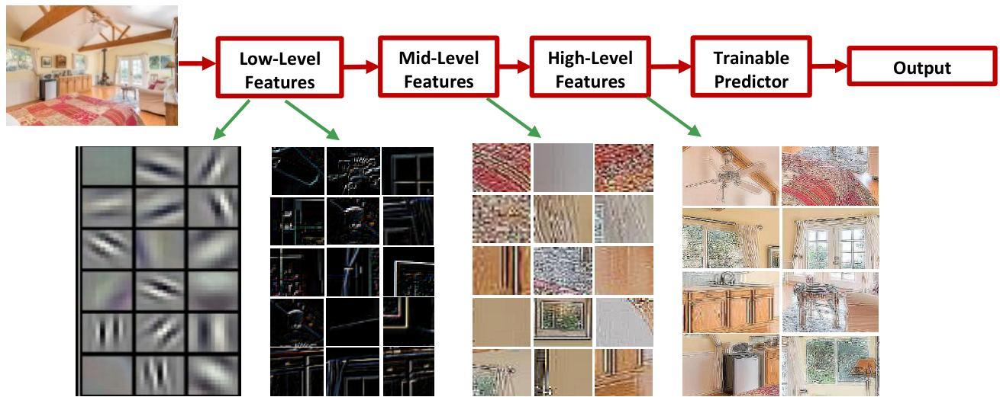

# Patterns and deep learning?

Until now: focus placed on explicit pattern discovery (classic and subspace clustering)

What about deep learning? Multi-layer learning process to extract rich implicit patterns

- image: pixels → edges → textures → motifs → parts → objects
- text: character → word → word group → clause → sentence → story

TÉCNICO+

FORMAÇÃO AVANÇADA

by Param Vir Singh