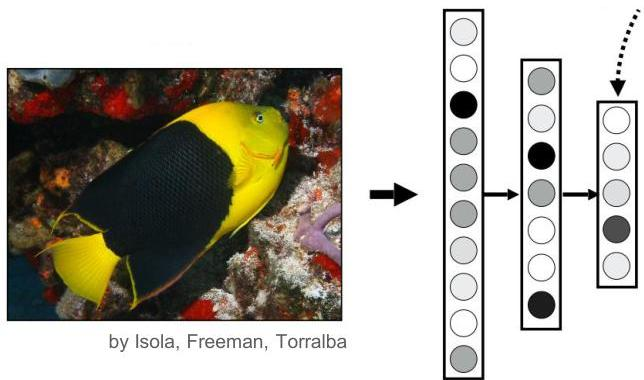

# Patterns and deep learning?

- Hidden unit ≈ latent pattern
- high-weight connections ≈ frequent features
- activations per observation ≈ pattern support

- Recall the following properties of a good representation
- **disentangled** explanatory factors
- each unit should capture a separate, meaningful aspect of the data
- **loose factor dependencies**
- **sparsity**: for any observation x, only some factors are relevant

42

TÉCNICO+

FORMAÇÃO AVANÇADA