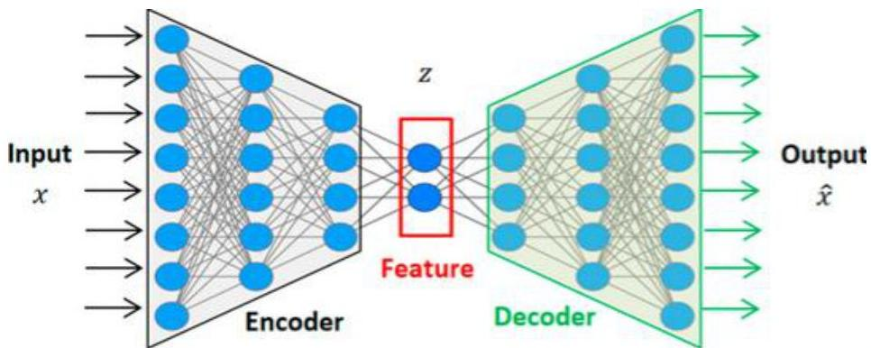

# Learning from temporal data: traditional

Temporal data can be mapped into numeric vectors (embeddings) to subsequently apply classic ML

- embeddings are latent feature representations with minimal information loss
- recall the paradigmatic unsupervised case: autoencoders (AE)
- principle: preserve as much information in a compact vector by maximizing reconstruction ability
- enhanced expressivity when considering multi-task self-supervision: check our early class!
- the neural architecture should be able to capture temporal dependencies:
- recurrent layering (e.g., LSTMs), convolutional layering, transformer layering...
- classic ML descriptors and predictors (prepared to learn from tabular data)

TÉCNICO+
FORMAÇÃO AVANÇADA