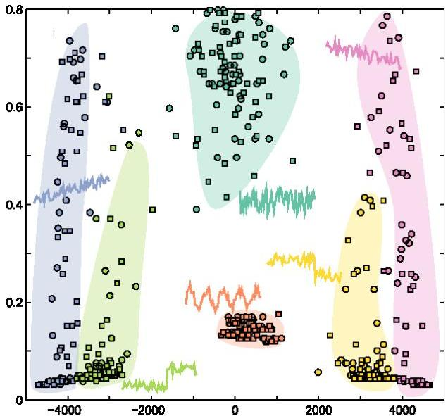

# Learning from temporal data: distance-based

- Approaches that rely on distances between two observations
- The simplest regressor/classifier is lazy learning
- train: use temporal distances to detect the nearest neighbors
- test: use them to estimate targets

TÉCNICO+ FORMAÇÃO AVANÇADA