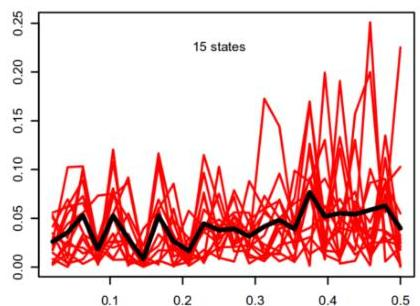
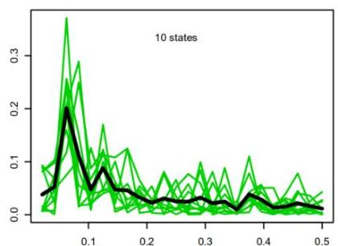

# Learning from temporal data: distance-based

- Temporal data clustering based on distances between observations and centroids:
- partition-based clustering (k-medoids)
- agglomerative clustering
- density-based clustering

- replace simple tabular distances (e.g. Minkowski) for distances able to accommodate temporal misalignments (e.g. elastic distances such as DTW for time series)

TÉCNICO+

FORMAÇÃO AVANÇADA