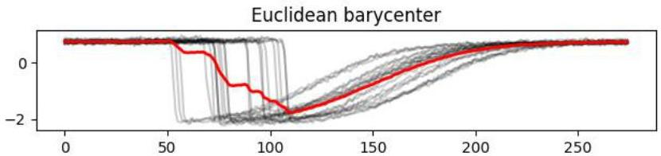
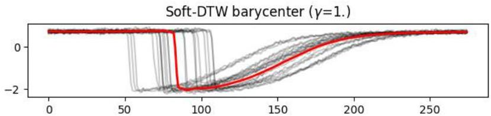

# Learning from temporal data: distance-based

- Centroid of a cluster of temporal observations (e.g., time series) referred as barycenter

- Partitioning-based methods
- means not adequate as centroid if time series are misaligned
- solution: medoids (prototype time series minimizing DTW) or barycenter-driven $k$-means (e.g. tslearn package)

TÉCNICO+
FORMAÇÃO AVANÇADA