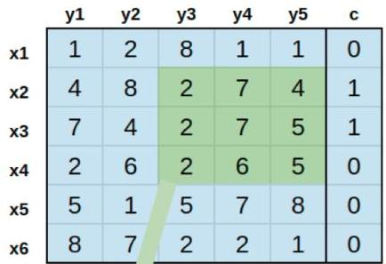
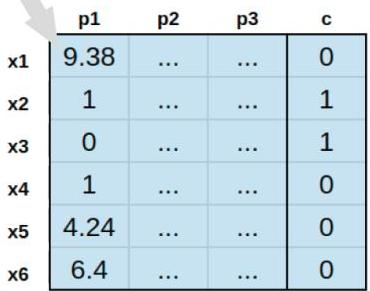

# Learning from temporal data: associative

Euclidean ([8,1,1], [2,7,5]) = 9.38

Transformation

Pattern 1

$$
y _ {3} = 2; y _ {4} = 7; y _ {5} = 5
$$

$$
\text{lift} = \frac {\frac {2}{6}}{\frac {3}{6} \times \frac {2}{6}} = 2
$$

- Under this mapping: clustering solutions and high-order patterns can be as well pursued

TÉCNICO+

FORMAÇÃO AVANÇADA