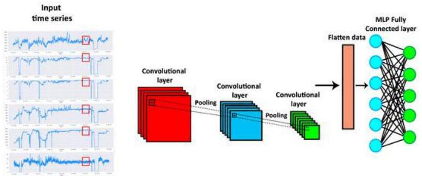

# Learning from temporal data: deep

Dedicate layering: recurrent (e.g. LSTMs), convolutional (1D or 2D depending on whether data is univariate or multivariate), temporal convolutions, transformer-based...

- Descriptive: learn NNs to denoise (autoenconding observations), extract features, impute...
- Precitive: end-to-end supervised learning
- TRAIN: learn expressive functions that map time-rich inputs and corresponding targets
- TEST: apply the function on testing observations and return the estimates

TÉCNICO+ FORMACÃO AVANÇADA