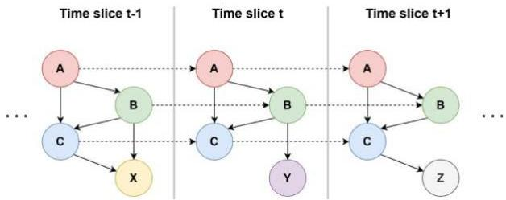
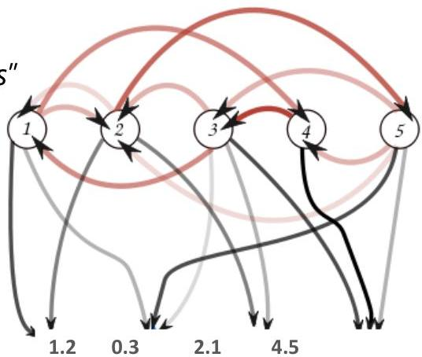

# Learning from temporal data: deep

Classic time-aware models can be deep (many parameters): although less used, remain relevant

## Dynamic Bayesian networks

## Hidden Markov models

- Descriptive: describe system dynamics from time series or sequence data
- check "generative modeling of repositories of health records"
- Predictive:
- TRAIN: learn an automaton per class based on the observed time series for each class
- TEST: given a testing time series, see how each of the automaton better describes it and output the automaton's class as the result

24