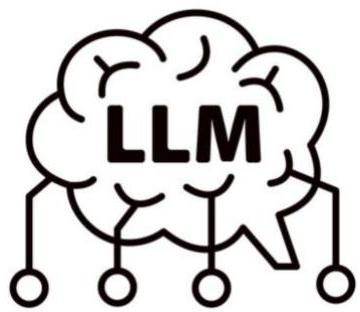

# Learning from temporal data: LLM prompting

Yet an option as LLMs hold unique "analytical" capacities from:

- large-scale multi-task pretraining
- learn cross-domain regularities transferable to different tasks (e.g. descriptive, predictive, inferential), enabling generalization beyond task-specific models
- store latent abstractions of patterns, relationships, and dependencies

- universal sequence modeling
- trained to model sequences, allowing them to process text, code, time series (as serialized inputs) and other (time-rich) data structures
- inherent capacity to handle variable-length and irregular inputs

- in-context learning
- can infer task structure directly from prompts (zero-shot)
- can be guided by few-shot examples without the need for parameter updates (fine tuning)

TÉCNICO+

FORMAÇÃO AVANÇADA