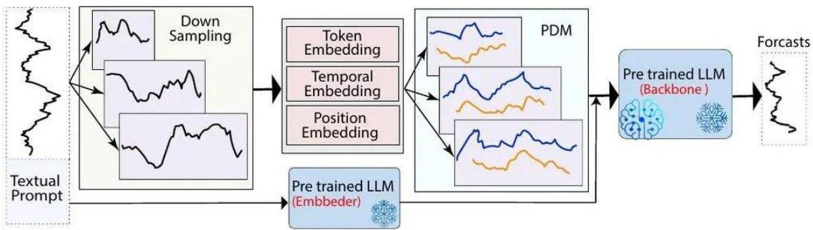

# Learning from temporal data: LLM prompting

- Some multimodal LLMs indeed trained on temporal data...

- Prompting principles for predictive tasks
- clearly specify the prediction horizon and assumptions
- constrain outputs to probabilistic or scenario-based estimates
- explicitly ask to separate data-driven inference from speculation

- Example: Given the historical data, forecast the next 7 time steps, disclosing uncertainty drivers.
- Best suited for short-term forecast assistance, scenario analysis, decisions under uncertainty

TÉCNICO+ FORMACÃO AVANÇADA