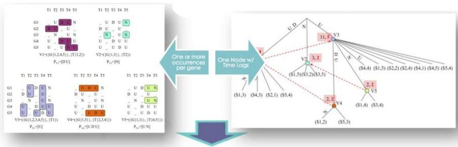
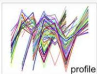
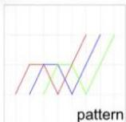
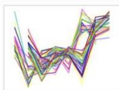
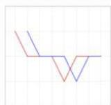

# Time series biclustering

- Recall: **biclustering** aims at discovering patterns in simple multivariate data such that each pattern satisfies specific criteria of *homogeneity* and *statistical significance*
- can further include *dissimilarity* and, given variables of interest, *predictive power*

- Biclustering is also used to retrieve patterns from *univariate time series*
- a *bicluster* is a subset of *observations* with coherent values on a subset of *time points*
- *contiguity* is generally assumed across time points (convex temporal pattern)
- *temporal misalignments* between observations can be further accommodated (e.g. patients at different disease stages)

"Late"
Biclusters
same pattern
potential delay

TÉCNICO+
FORMAÇÃO AVANÇADA