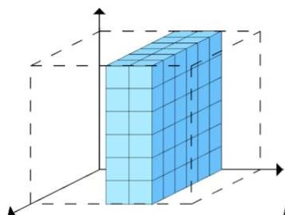
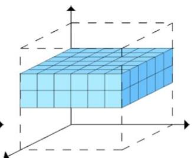
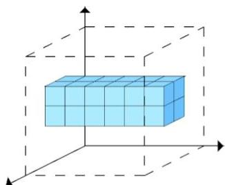
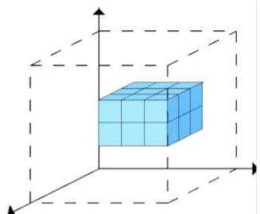

# Triclustering

- How to discover patterns in multivariate time series (MTS) data?
- MTS data: each observation is described by a set of variables measured along time
- Option: triclustering
- a **tricluster** is a subset of observations, variables and time points with good:
- homogeneity, e.g. well established temporal pattern on a subset of variables
- statistical significance, e.g. unexpected high #observations supporting the pattern

Full-clustering on attributes

Full-clustering on observations

Partial-clustering (all attributes)

Partial-clustering (all observations)

Triclustering

TÉCNICO+
FORMAÇÃO AVANÇADA