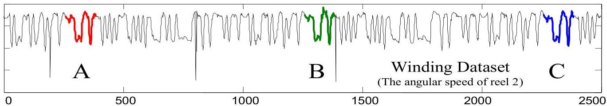
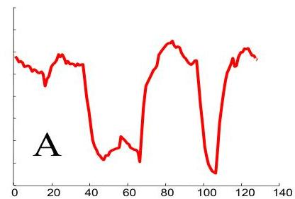
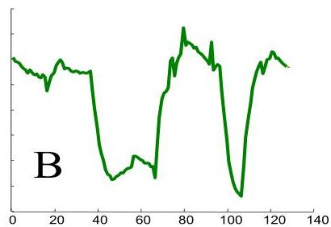
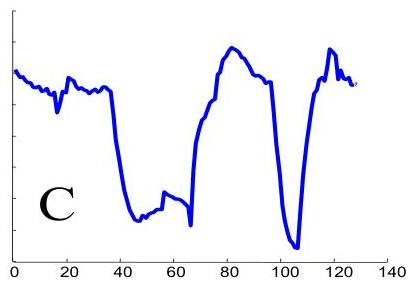

# Motif discovery

- To exhaustively find all motifs: combinatorially explosive number of distances to compute
- the obvious brute force search algorithm is just too slow!
- one solution: symbolize the time series and apply efficient intersections on a sliding basis

TÉCNICO+ FORMAÇÃO AVANÇADA