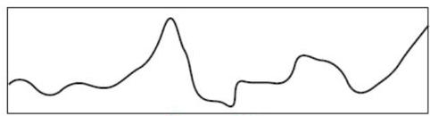
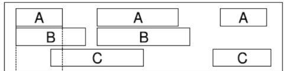
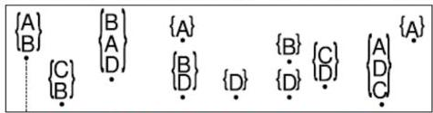
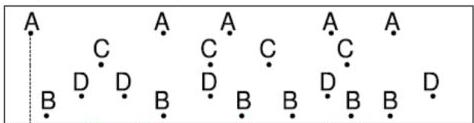

# Temporal data structures

- Some examples...

A numeric time series is a time series with numerical values for each time point.

Sensor data

Discretization

A symbolic time series is a time series with nominal values for each point.

ABCBDADBBCBAAABBCBDBABDABA

DNA sequences

A symbolic interval sequence has overlapping intervals with nominal values.

Sign language

An itemset sequence is a time sequence with sets of nominal values assigned to each time point.

Shopping baskets for same customer

A symbolic time sequence has nominal values with possible duplicate time points

Events from machine service logs

4