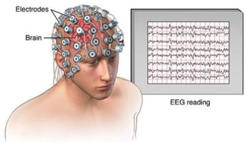

# Case: EEG analysis

- Given a raw electroencephalographic signal:
- multivariate time series with $p$ order (corresponding to #electrodes)
- nearly impossible to interpret in raw form
- spectral analysis to decompose signal into activity levels (waves)
- gamma (40-100Hz): cognition, info processing, learning
- beta (12-40Hz): conscious focus, memory, problem solving
- alpha (8-12Hz): transition between focus and relaxation
- theta (4-8Hz): emotional connection, relaxation
- delta (0-4Hz): healing, restorative/deep sleep

- Use **triclustering** or (multivariate) **motif discovery** to find patterns on the frequency representation of the raw signals
- e.g. decreased alpha-to-gamma activity in the frontal lobe and increased high activity in the occipital lobe is a statistically significant pattern and discriminative of schizophrenia

TÉCNICO+
FORMAÇÃO AVANÇADA