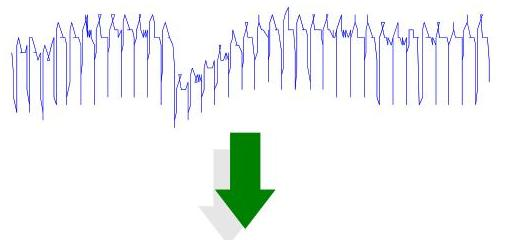
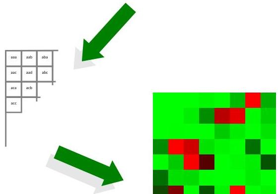

# Time series bitmaps

- SAX benefits...
- finding motifs
- visualizing massive time series
- clustering streaming time series
- kolmogorov complexity data mining
- classification and indexing

- These ends are grounded bitmap analysis:

|  a | b  |
| --- | --- |
|  c | d  |
|  aa | ab | ba | bb  |
| --- | --- | --- | --- |
|  ac | ad | bc | bd  |
|  ca | cb | da | db  |
|  cc | cd | dc | dd  |

accbabcbdcabdcabcdbcdcadbaacb...

TÉCNICO+

FORMAÇÃO AVANÇADA