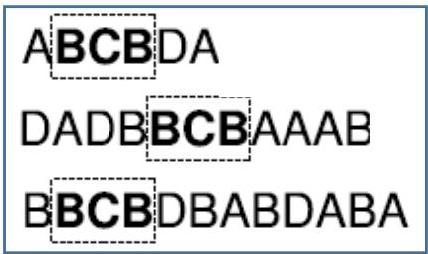
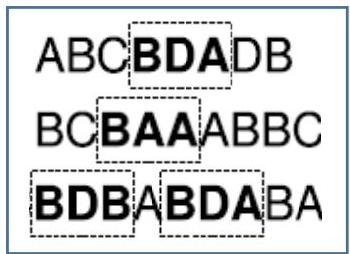

# Patterns in symbolic time series data

## Examples

- symbolic motifs in a single series
- substring patterns (B → C → B)
- sequence of symbols
- extensions to allow gaps
- regular expression patterns (B → ¬C → A | B)
- extension to allow gaps (via wildcards), negations, repetitions, etc.

Exercise: are the given patterns sufficient to describe web usage behavior? Any addition?

TÉCNICO+
FORMAÇÃO AVANÇADA