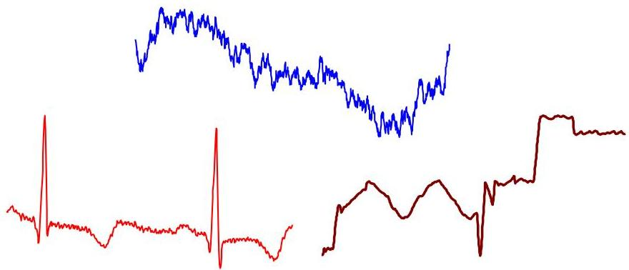

# Time series

- Time series: sequence of values or symbols along time $\mathbf{x} = <x_1, ...,="" x_t="">$
- univariate or multivariate, $x_j \in \mathbb{R}^m$ (or $x_j \in \{Y_1 \dots Y_m\}$), where $m$ is the multivariate order
- Time series data: $\{\mathbf{x}_1, \ldots, \mathbf{x}_n\}$ where $\mathbf{x}_i$ is a time series
- People measure things...
- their blood pressure
- the annual rainfall in New Zealand
- the value of their Yahoo stock
- the number of web hits per second
... and things change over time

time series occur in near every public, scientific and businesses domain

TÉCNICO+
FORMAÇÃO AVANÇADA</x_1,>