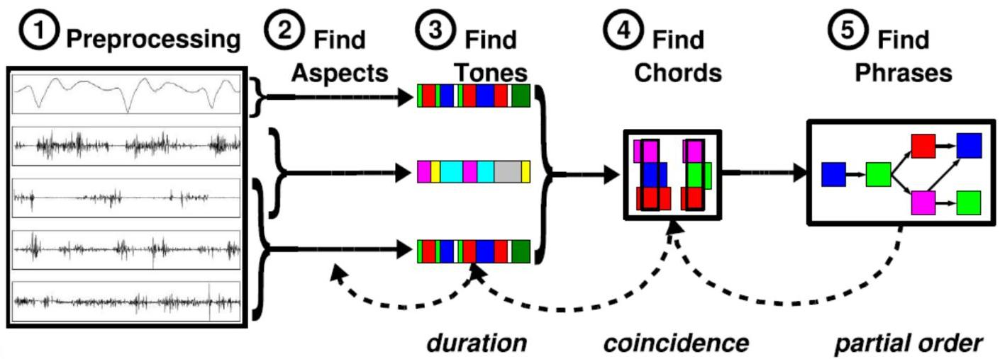

# Patterns in multivariate time series

Example: pattern mining on multivariate time series
- tone mining: discretization, segmentation
- chord mining: variation of itemset mining
- phrase mining: variation of partial order mining

TÉCNICO+ FORMAÇÃO AVANC

duration

coincidence

partial order

50