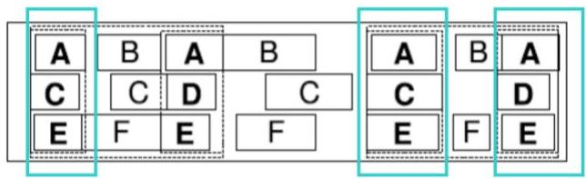
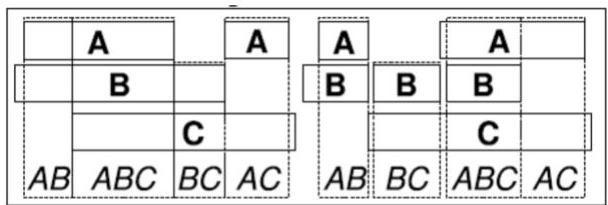
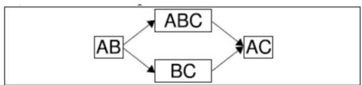

# Patterns in multivariate time series

- Tones represent duration with intervals
- Chords represent coincidence of tones
- Phrases represent partial order of chords

Chords

Phrase

TÉCNICO+
FORMAÇÃO AVANÇADA