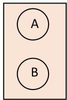
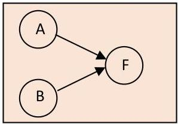

# Frequent episodes

- Episode is an arrangement of events
- serial episode: F appears after E
- parallel episode: A appears with B in any order
- hybrid serial-parallel episode: no total order

- Two formulations:
- frequent episodes along a single sequence
- similarities with motif discovery?
- frequent episodes on a dataset of sequences
- similarities with sequential pattern mining?

TÉCNICO+
FORMAÇÃO AVANÇADA