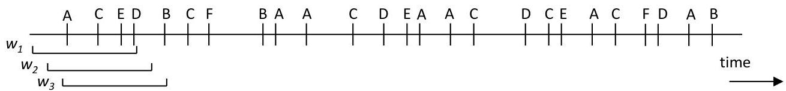

# Frequent episodes

- Given a sliding windows, the frequency of an episode $P$: fraction of windows where $P$ appears
- Apriori-style search, given maximum window length:
- find frequent events (e.g., A, B, C)
- generate candidate episodes (e.g., AB, AC, BC), counting frequencies
- find next-level episodes
- Efficient counts:
- no need to count all arrangements when sliding (updates)
- WINEPI search further uses automata and hierarchies

TÉCNICO+
FORMAÇÃO AVANÇADA