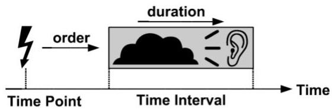
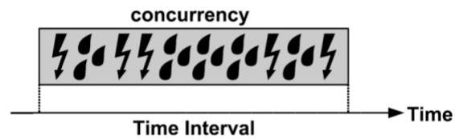
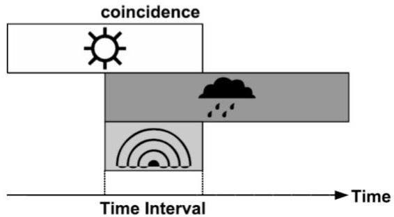

# Interval series data

- Duration: persistence of an event along time points
- Order: sequential occurrence of time points or intervals
- Concurrency: closeness of two or more events in time
- Coincidence: intersection of intervals
- Synchronicity: synchronous occurrence of two events
- Periodicity: repetition of the same event with a nearly constant period

TÉCNICO+

FORMAÇÃO AVANÇADA