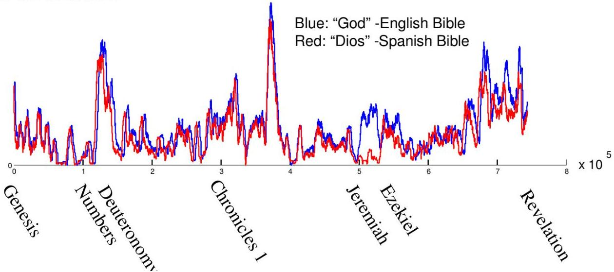

# Time series

- Time series are ubiquotous: monitoring biological, individual, organizational, geophysical, digital, mechanical, societal systems
- Movement, image and video as time series
- Text data as time series

TÉCNICO+ FORMAÇÃO AVANÇADA