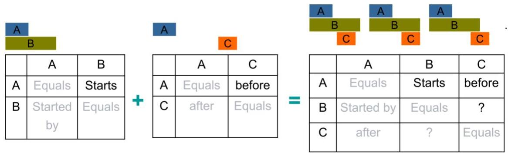

# Patterns in interval series data

Apriori-style [Hoeppner 2001]

- combine two $k$-patterns with common $k - 1$ prefix

- use transitivity of interval relations to prune candidates
- B {contains, ended by, overlaps, meets, before} C
- pruned relations: {after, met by, overlapped by, started by}

TÉCNICO+

FORMAÇÃO AVANÇADA