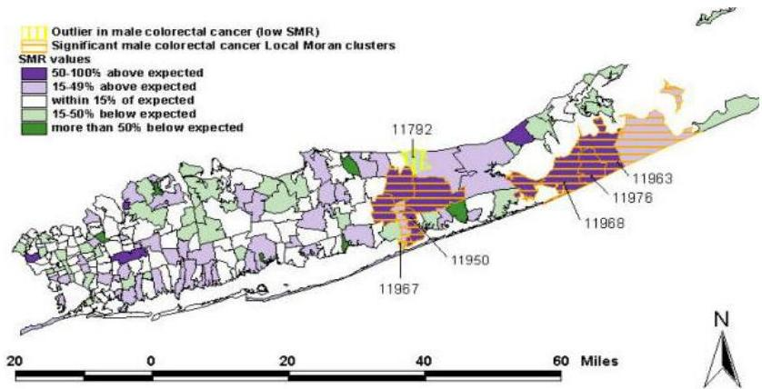

# Spatiotemporal data

- Epidemiology data (geography of health)
- Example: patterning of viral spread?
Changes in transmissibility over space and time?
- E-commerce and marketing data
- What happens if a new store is added?
- predicting consumer spatial behaviors
- delineating trade areas
- analyzing market performance
- How sales divert geographically? Trends?
- changes in population, ethic-mix, and transportation network impact choices and communication with customers

TÉCNICO+
FORMAÇÃO AVANÇADA