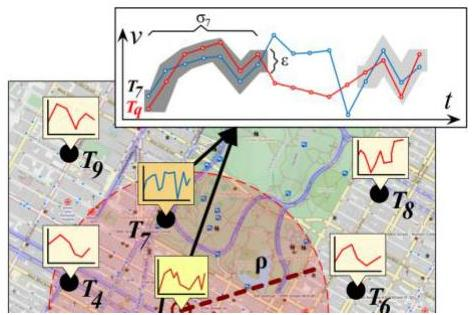
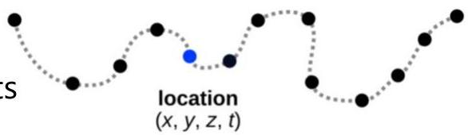

# Spatiotemporal data structures

- georeferenced observations
- tabular data with spatial attributes
- e.g. location of individuals, geographies, stores, etc.
- geolocalized time series data
- e.g. telemetry data: measurements at a specific location

- timestamped georeferences
- trajectory / moving object data
- e.g. city mobility, vehicle monitoring, deep space objects
- geolocalized event data
- e.g. location of payments, health records, shopping baskets, activities of interest

- continuous/interpolated spatial data (e.g. geophysical maps)

TÉCNICO+

FORMAÇÃO AVANÇADA