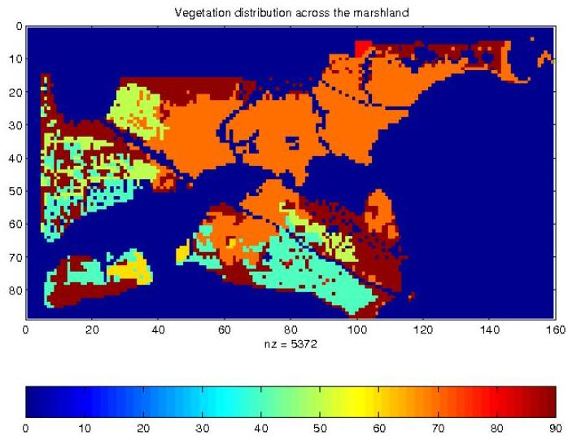

# Learning: spatial autocorrelation

- Classical data mining
- observations assumed to be independent
- cross-correlation measures
- Spatiotemporal data mining
- observations are not independent
- nearby observations tend to be more similar than distant observations
- spatial autocorrelation
- spatial heterogeneity

TÉCNICO+
FORMAÇÃO AVANÇADA